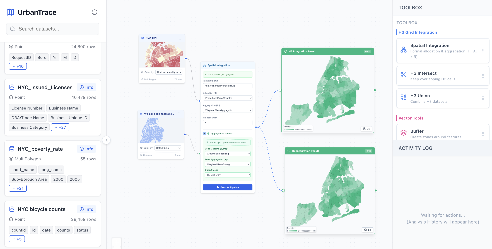

# UrbanTrace 🏙️

> A node-based ETL tool for urban planning and geospatial analysis.

UrbanTrace lets you visually construct data pipelines on an infinite canvas — blending GeoJSON datasets with spatial operations like Merges.




---

## ✨ Features

### 🗂️ Data Library (Left Sidebar)
- Fetches and lists GeoJSON files from the backend
- Real-time search and filtering by dataset name
- Drag & drop onto the canvas to instantiate nodes

### 🖼️ Analysis Canvas (Center)
- Infinite workspace powered by **React Flow** (pan, zoom, multi-select)
- **Dataset Nodes** — source files with a Details modal for metadata inspection
- **Operation Nodes** — spatial tools (Buffer, Intersection, Join)
- **Deck.GL Mini-Maps** — choropleth previews with data-driven styling and tooltips, rendered inside each node

### 🔧 Operations Toolbox (Right Sidebar)
- Tools grouped by domain (Geospatial vs. Attribute)
- Draggable onto the canvas
- Config-driven — easy to extend with new modules

### ⚙️ Operation Node (Interactive Analytical Engine)
- **Fluid Resizing:** Drag to resize the node; the Deck.GL map inside recalculates its dimensions instantly via WebGL sync
- **Live H3 Spatial Processing:** Executes real set operations (Union, Intersection) on the backend by converting geometries into standardized H3 hexagon indexes
- **Interactive 2D/3D Canvas:** Powered by a custom `H3PreviewDeckGL` component — toggle between a flat 2D density view and a 3D extruded view inside the node
- **Contextual Density Legends:** In 2D mode, dynamically calculates dataset overlap counts and renders a compact color-scale legend inside the viewport
- **Polished Execution States:** Frosted-glass "Processing..." overlay activates during backend computation
---

## 🏗️ Tech Stack

| Layer | Technology |
|---|---|
| Frontend | React, Vite, React Flow, Lucide React, Axios |
| Visualization | Deck.GL (WebGL vector rendering), H3-js |
| Spatial Engine | H3 (Uber's Hexagonal Hierarchical Spatial Index) |
| Backend | Python, FastAPI |
| Data Format | GeoJSON |

---

## 📁 Project Structure
```text
urbanTrace/
├── backend/
│   └── main.py
├── data/
│   ├── geojson/          # GeoJSON datasets (not tracked in git)
│   └── metadata/         # Dataset metadata JSONs
└── frontend/
    ├── src/
    │   ├── components/   # Canvas, nodes, sidebars, visualization
    │   ├── config/       # Tool definitions
    │   └── App.jsx
    └── vite.config.js
```

---

## 🛠️ Setup

### Prerequisites
- Node.js v16+
- Python 3.9+

### Backend
```bash
cd backend
python -m venv venv
source venv/bin/activate
pip install fastapi uvicorn
uvicorn main:app --reload --port 8000
```

### Frontend
```bash
cd frontend
npm install
npm run dev
```

App runs at **http://localhost:5173**

---

## 🗺️ Roadmap

### Phase 1 — Visualization ✅
- [x] Drag & drop datasets
- [x] Node-based canvas
- [x] Deck.GL geometry previews inside nodes
- [x] Attribute-based choropleth styling

### Phase 2 — Transformation Engine 🚧
- [x] H3 hexagon-based spatial operations (Union, Intersection) via backend
- [x] Interactive Operation Node with live backend execution
- [x] 2D/3D toggle with H3 density preview inside nodes
- [x] Dynamic color-scale legend for overlap density
- [ ] Raster engine for grid/numpy-based processing
- [ ] Map algebra (Layer A + Layer B)
- [ ] Export results as GeoJSON or GeoTIFF

### Phase 3 — Advanced Features
- [ ] H3 Hexagon grid support
- [ ] Export results as GeoJSON or GeoTIFF
- [ ] Save/load node graph projects

---

## 📦 Data

NYC datasets included cover: population, poverty rate, unemployment, air pollution, housing units, pedestrian & bicycle counts, vehicle collisions, HVI, and more.

> Large GeoJSON files are not tracked in this repository. Download them separately and place in `data/geojson/`.

---

*Last updated: March 2026*